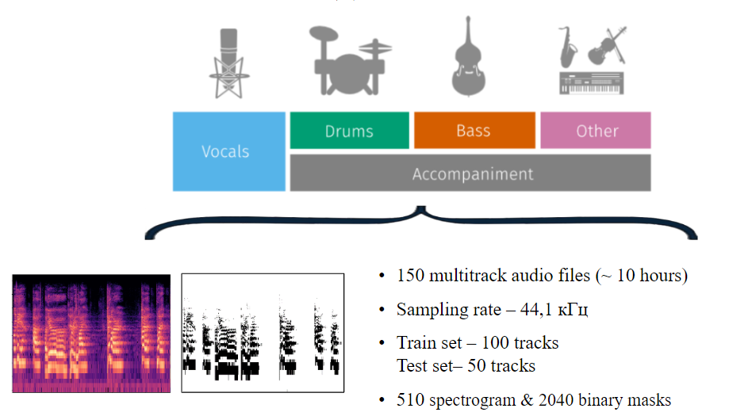

# Unmix

This project is a system for exporting audio tracks of different musical instruments, also known as sound source separation. It is a web application that implements a convolutional neural network using the Unet architecture.

For training the dataset [MUSDB HQ](https://sigsep.github.io/datasets/musdb.html) was used. Samples of the results are available here: *AUDIO HERE 

## Data Preprocessing

The CNN architecture works with multidimensional tensors, that is why before starting the process of training the model, from each musical composition was generated a spectrogram and a binary mask for each instrument, i.e. 4 binary masks and 1 spectrogram.

Binary masks was generated using [Librosa Softmax](https://librosa.org/doc/main/generated/librosa.util.softmask.html#librosa-util-softmask). Example of preprocessing data: 

 

## Neural Network Architecture

Unet - a CNN architecture used for solving segmentations problems, in this situation the model is detecting the patterns of different musical instruments sounds

## Extraction algorithm

The process of track extraction happens in the following order:

1. The system receives an audio file (wav/mp3)
2. A spectrogram of the audio data is generated
3. This spectrogram is passed as input tensor to the Unet model
4. The output tensor represents a predicted binary mask of the target instrument’s track 
5. The tensor of the input spectrogram is multiplied by the binary mask
6. Using the **[Griffin-Lim Algorithm](https://paperswithcode.com/method/griffin-lim-algorithm)** an audio track is generated from the result of the multiplication
7. This audio track is saved in as a file, and returned to the user

